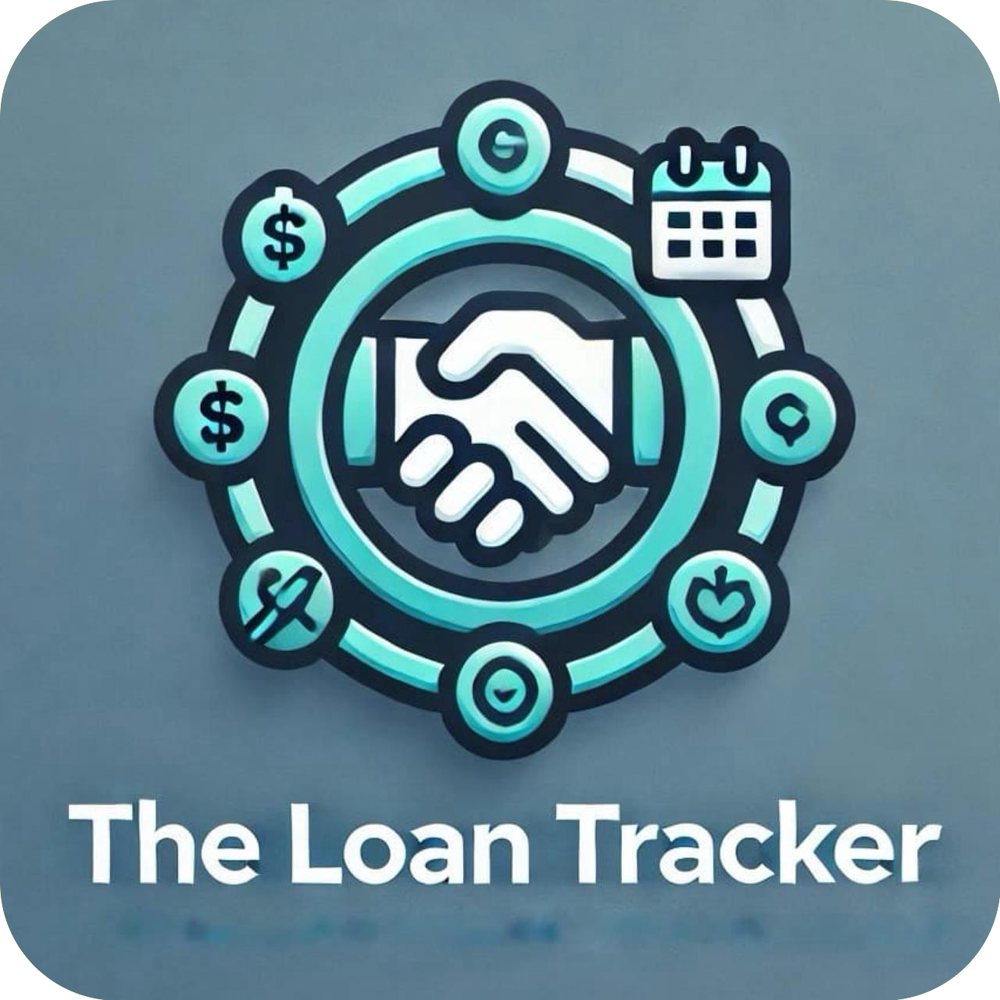

<p align="center">
  <a href="./static/assets/logo.jpeg" target="blank"></a>
</p>

[circleci-image]: https://img.shields.io/circleci/build/github/nestjs/nest/master?token=abc123def456
[circleci-url]: https://circleci.com/gh/nestjs/nest

  <p align="center"> The Loan Tracker is a application to track money you've lent or borrowed. Record and manage loans, set repayment reminders, and keep an overview of all transactions, ensuring you stay organized and never miss a repayment.</p>

## Description

The Loan Tracker is an application designed to help you keep track of all the money you have lent to your friends and family, or vice versa. It provides a convenient way to record and manage your loans, ensuring that you never lose track of who owes you money or who you owe money to. With the Loan Tracker, you can easily view and update your loan transactions, set reminders for repayment, and maintain a clear overview of your financial interactions. Stay organized and never let a loan slip through the cracks with the Loan Tracker.

## Framework & Library

- Node JS
- Nest JS
-

## Project setup

```bash
$ npm install
```

## Compile and run the project

```bash
# development
$ npm run start

# watch mode
$ npm run start:dev

# production mode
$ npm run start:prod
```

## Run tests

```bash
# unit tests
$ npm run test

# e2e tests
$ npm run test:e2e

# test coverage
$ npm run test:cov
```

## Resources

SThese resources were heavily referred to during the development of this project

- [NestJS Documentation](https://docs.nestjs.com)
- [Prisma Documentation](https://www.prisma.io/docs)
- [Google OAuth 2.0 Documentation](https://developers.google.com/identity/gsi/web/guides/overview)
- [stackoverflow](https://stackoverflow.com/)

## Stay in touch

- Author - [NIKHIL MUDDAMSETTY](https://www.linkedin.com/in/nikhil-muddamsetty/)

## License

Not for personal or commercial use
